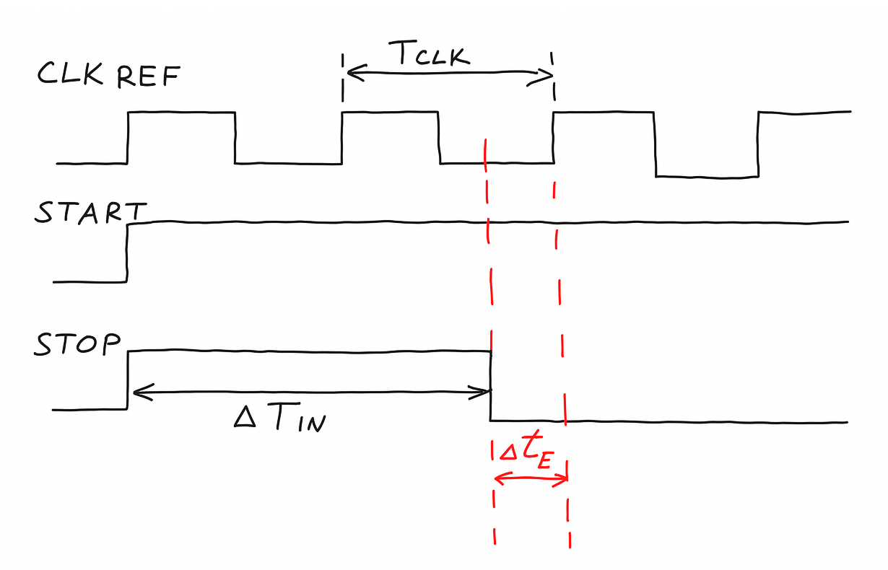
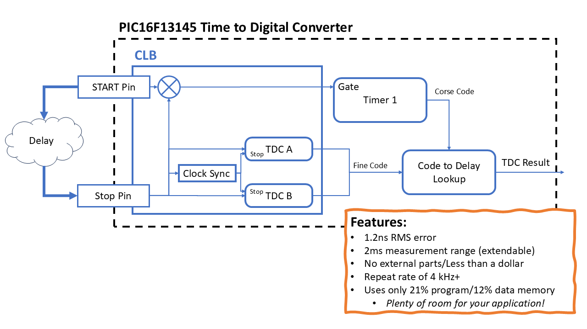
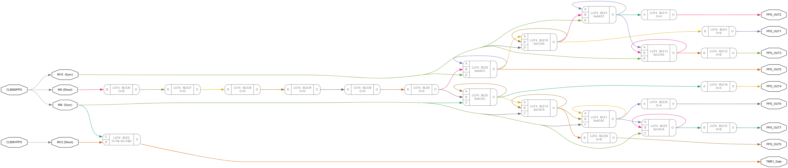
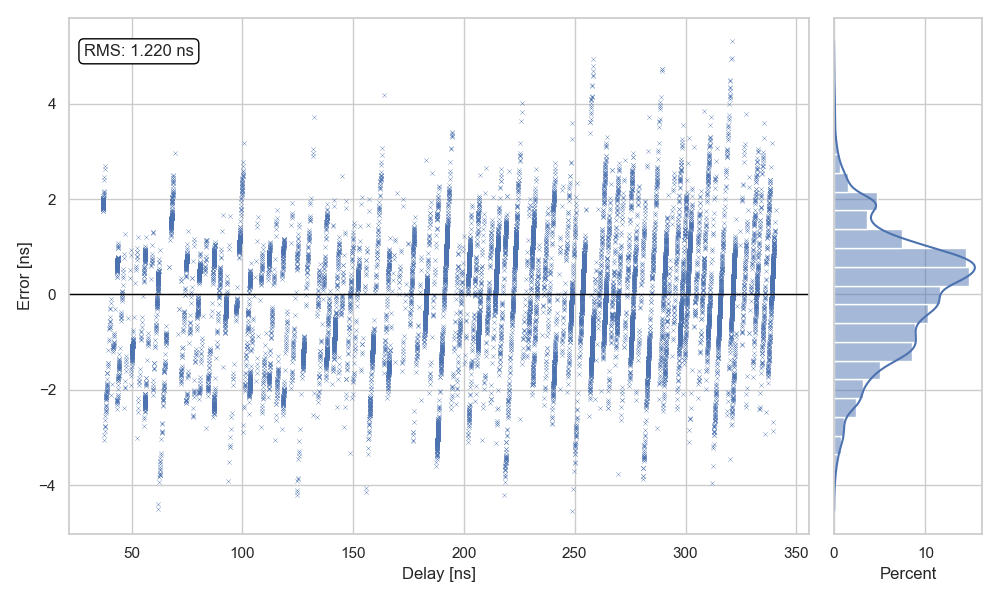

# CLB Time to Digital Converter (TDC)

Example of how to use the [Configurable Logic Block](https://www.microchip.com/en-us/products/microcontrollers/8-bit-mcus/peripherals/system-flexibility/clb)
 in the [PIC16F13145](https://www.microchip.com/en-us/development-tool/ev06m52a) as a [Time to Digital Converter](https://en.wikipedia.org/wiki/Time-to-digital_converter)

This is made possible because of the [reverse engineering](https://mcp-clb.markomo.me/) I did of the CLB bitstream format.

## What is a Time to Digital Converter?

A Time to Digital Converter (TDC) measures very small time intervals, 
often down to billionths of a second (nanoseconds), and converts them 
into digital values. You can think of it like a stopwatch for events 
happening too fast for ordinary electronics to track. Time to Digital 
Converters are used when timing matters more than anything else, such 
as in LIDAR, particle physics, or ultrasound imaging.

DCs are used in a wide range of applications, such as:

* [ATLAS detector at CERN;](https://cds.cern.ch/record/2282813/files/arXiv%3A1708.03692.pdf?utm_source=chatgpt.com) used to [discover the Higgs Boson](https://arxiv.org/pdf/1207.7214)

* [Positron Emission Tomography (PET) scanners;](https://pmc.ncbi.nlm.nih.gov/articles/PMC4747834/?utm_source=chatgpt.com) used for [cancer detection](https://www.mayoclinic.org/tests-procedures/pet-scan/about/pac-20385078)

* [Quantum Key Distribution (QKD) links; for securing data center communication](https://opg.optica.org/abstract.cfm?uri=QUANTUM-2024-QW3A.38)

* [Used as a Physically Unclonable Function for IoT security](https://scispace.com/papers/a-physically-unclonable-function-using-time-to-digital-5bd26qmzp3?utm_source=chatgpt.com)

## How does it work?

Time to Digital Converters operate by splitting the measurement into two parts:

* **Coarse Time**: measured in full clock cycles using the system timer

* **Fine Time**: the fractional delay within a single clock cycle

All logic is implemented in software and the Configurable Logic Block (CLB), 
with control handled by the TDC driver code. Coarse time is measured using 
Timer1, gated by an XOR of the START and STOP signals. Fine time is resolved 
using two interleaved tapped delay lines built in the CLB. These lines are 
placed with precise control over routing and logic placement to achieve 
consistent propagation delays. These interleaved chains exploit sub-stage skew 
between input mux paths to double the effective resolution.

The STOP signal is injected into both a synchronized and an unsynchronized 
path. The unsynchronized version begins immediate propagation through the 
delay chain, while the synchronized version aligns with the next clock edge 
and serves as a timing reference. The number of delay stages traversed by the 
signal before sampling encodes the fine time offset between the STOP event and 
the next system clock edge

This architecture is built entirely from internal logic with deterministic 
configuration and requires no external components. However, CLB outputs can 
only be read through PPS pins, so 8 of them are occupied during measurement.

## Performance

 * 1.2ns RMS/5ns peak error
 * Repeat rate of over 4 kHz
 * This example uses only 21% of program memory and 12% of data memory

30-300ns sweep:

This project is *not affiliated with, endorsed by, or sponsored by Microchip Technology Inc.*
"Microchip" and "CLB" are trademarks of *Microchip Technology Inc.*
All product names, logos, and brands belong to their respective owners.

